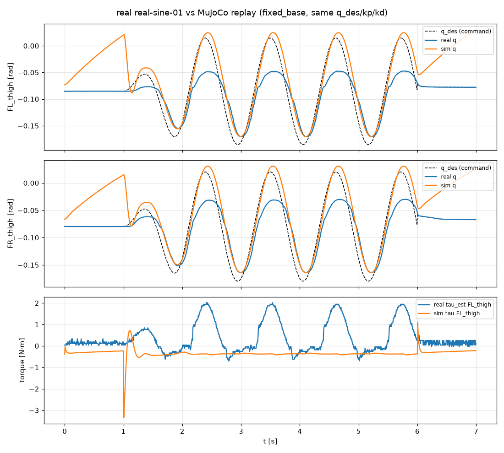
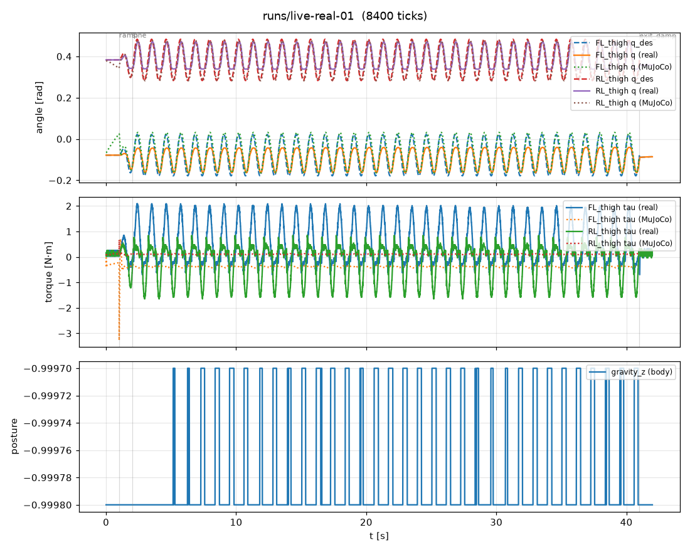

# MuJoCo vs 실기 비교

같은 명령을 넣었을 때 시뮬레이션과 실기가 얼마나 다른지 본다. 두 가지 도구가 있다.

- `tools/compare_sim_real.py`: 실기 기록(`trace.csv`)의 명령열(q_des, kp, kd)을 MuJoCo 에 **그대로 재생**하고 비교한다 (오프라인).
- `tools/live_compare.py`: 실기를 움직이는 **같은 틱**에 가드를 거친 동일한 명령을 MuJoCo 쌍둥이에도 보내고,
  브라우저 차트로 관절각·토크를 실시간 비교한다 (온라인). 끝나면 `real.csv`, `sim.csv`, `summary.json` 을 남긴다.

둘 다 제어기를 다시 돌리는 것이 아니라 실기가 받은 명령을 시뮬 로봇에 똑같이 넣으므로, 차이는 순전히 "로봇(물리)" 쪽의 차이다.

## 시뮬 쌍둥이 모델 선택

실기 시험은 **몸통을 박스 위에 올려 다리를 공중에 띄운 상태**에서 했다 (SDK 가 E9 전에 권하는 지지 상태).
실기 데이터도 이를 뒷받침한다: 발 반력 ≈ 0, 관절 토크 ≈ 0, 허벅지가 거의 수직(URDF 기하로는 발이 엉덩이 아래 0.33 m),
댐핑 중에도 다리가 움직이지 않음. 따라서 쌍둥이는 몸통을 공중에 고정한 모델(`MujocoBackend(fixed_base=True)`)을 쓴다.

바닥에 놓는 모델로 같은 기록을 재생하면 초기 자세를 유지하지 못한다(안착 중 관절 0.69 rad 이동, 뒷다리 진폭비 3~4배).
아래 표의 "바닥" 열이 그 결과이며, 지지 상태 실험에는 쓰지 않는다.

| 재생 모드 | 안착 중 관절 변화 | 관절각 차이 RMSE (12관절 / 구동 4관절) |
|---|---|---|
| 바닥 (`--base-z 0.22`) | 0.686 rad | 0.123 / 0.170 rad |
| **몸통 고정 (`--fixed-base`)** | **0.013 rad** | **0.028 / 0.035 rad** |

## 결과 1: 오프라인 재생 (real-sine-01, 허벅지 ±0.1 rad 0.9 Hz, kp 30 / kd 1.2, 1400틱)

```bash
python tools/compare_sim_real.py runs/real-sine-01 --joints FL_thigh,FR_thigh --fixed-base --out runs/compare-sine-01-fixed
```



| 관절 | RMSE 실기−시뮬 | 최대차 | 진폭비 실기 | 진폭비 시뮬 | 지연 실기 | 지연 시뮬 | 토크 피크 실기 | 토크 피크 시뮬 |
|---|---|---|---|---|---|---|---|---|
| FL_thigh | 0.049 rad | 0.109 | 0.62 | 1.01 | 60 ms | 45 ms | 2.02 N·m | 3.35 N·m |
| FR_thigh | 0.043 | 0.095 | 0.67 | 0.98 | 65 | 45 | 1.43 | 2.94 |
| RL_thigh | 0.021 | 0.053 | 0.68 | 0.97 | 65 | 45 | 1.50 | 1.19 |
| RR_thigh | 0.019 | 0.041 | 0.79 | 0.97 | 70 | 45 | 1.06 | 1.23 |

진폭비 = 실제 움직인 폭 / 명령 폭. 지연 = 명령 대비 상호상관 최대 지점.

## 결과 2: 실시간 비교 (live-real-01, 같은 동작 40 s, 8200틱)

```bash
docker/sdk.sh bash -c "source docker/dds_env.sh && python3 tools/live_compare.py --backend dds --program sine --joints thigh --amp 0.1 --seconds 40 --twin fixed"
# PC 에서:  ssh -L 8767:127.0.0.1:8090 thor  →  http://127.0.0.1:8767/
```



| 관절 | RMSE 실기−시뮬 | 추종 RMSE 실기 | 추종 RMSE 시뮬 | 진폭비 실기 | 진폭비 시뮬 | 지연 실기 | 지연 시뮬 |
|---|---|---|---|---|---|---|---|
| FL_thigh | 0.039 rad | 0.036 | 0.024 | 0.62 | 0.98 | 60 ms | 45 ms |
| FR_thigh | 0.037 | 0.035 | 0.023 | 0.67 | 0.97 | 65 | 45 |
| RL_thigh | 0.026 | 0.032 | 0.018 | 0.67 | 0.97 | 60 | 45 |
| RR_thigh | 0.018 | 0.028 | 0.019 | 0.78 | 0.97 | 65 | 45 |

쌍둥이 시뮬과 HTTP 서버를 같은 프로세스에서 돌려도 200 Hz 루프의 기한 초과는 8200틱 중 3회(최대 지연 15 ms)였다.
오프라인 재생과 실시간 비교의 수치가 같은 것은, 시뮬이 결정적이고 실기 동작이 재현성 있게 반복됨을 뜻한다.

## 해석

1. **시뮬은 명령을 거의 그대로 따른다.** 진폭비 0.97~1.01, 지연 45 ms. kp 30 / kd 1.2 의 2차 응답에서 기대되는 값이다.
2. **실기는 명령 진폭의 62~78%만 움직이고 15~20 ms 더 늦다.** 앞다리(0.62~0.67)가 뒷다리(0.67~0.78)보다 덜 움직인다.
3. **정지 마찰이 있다.** 댐핑(kp 0)만 보내는 1초 동안 시뮬 다리는 중력 평형점으로 흔들려 가는데 실기 다리는 전혀 움직이지 않는다.
   MJCF 의 관절 마찰(`frictionloss 0.02`)은 실물보다 훨씬 작다. 진폭 손실의 가장 유력한 원인이다.
4. **토크 추정치는 서로 다른 양이다.** 실기 `tau_est` 피크 1.2~2.1 N·m 는 드라이버의 전류 기반 추정이고, 시뮬 토크는 같은 PD 식의
   출력이다. 실기가 덜 움직이므로 PD 오차항은 더 큰데 추정 토크는 더 작다 → 드라이버 내부에서 게인 스케일·전류 제한·마찰 보상 여부가
   모델과 다를 수 있다.
5. **RL 허벅지는 아래 반환점(약 0.32 rad)에서 평평해진다.** 시뮬에는 없는 접촉(박스 모서리 또는 기계적 한계)으로 보인다. 실물을 확인할 것.

sim2real 관점: 시뮬에서 학습한 정책은 관절이 명령의 ~97%를 따른다고 가정하지만 실기는 0.9 Hz 에서 ~30% 덜 움직인다.
해결 방향은 (a) 실기 kp 를 올리거나 마찰 피드포워드를 넣기, (b) 학습 시 마찰·백래시·지연 무작위화(사양의 domain randomization),
(c) 모델의 `frictionloss`/`damping` 을 실측에 맞추기다. 이 도구들로 (c) 를 맞춘 뒤 다시 비교하면 된다.

## 결과 3: MuJoCo vs Isaac Sim (같은 sine, 시뮬레이터끼리)

2026-09-17 노트북에서 같은 조건(몸통 고정, 허벅지 ±0.1 rad 0.9 Hz, kp 30 / kd 1.2, 1 ms PD substep)으로 MuJoCo 와 Isaac Sim 6.1(PhysX)을
각각 돌려 플랫폼 비교 탭에서 겹쳤다 (`mj-sine-fixed-01` vs `isaac-sine-fixed-01`, 시작 자세 기준).

| 지표 | MuJoCo vs Isaac PhysX | MuJoCo vs 실기 (참고) |
|---|---|---|
| RMSE | 0.006–0.007 rad | 0.18 rad |
| 상관 | 1.00 | 0.70–0.75 |
| 진폭비 (X) | 1.00 | 0.62–0.79 |
| 지연 (X) | 10–15 ms | 60–70 ms |
| 토크 피크 (X) | 1.27 N·m | 1.1–2.0 N·m |

두 시뮬레이터는 사실상 같은 답을 낸다. 따라서 실기와의 차이는 시뮬레이터 선택이 아니라 실기 관절의 마찰·지연에서 온다.
Isaac 의 Newton 엔진(MuJoCo-Warp)도 같은 sine 에서 RMSE 0.009 rad 로 MuJoCo 와 일치한다 (`isaac-newton-sine-fixed-01`, 토크 피크 1.67 N·m 로 조금 높음). 자세한 설정은 [isaac.md](isaac.md).

## 방법 요약

1. 실기 기록의 첫 관절각으로 시뮬을 초기화한다 (몸통 고정, 또는 바닥 모드면 `--base-z` 높이).
2. 1초 동안 kp 30 으로 초기 자세를 잡고 안착시킨 뒤, 안착 후 관절 변화량을 기록한다.
3. 실기 기록의 모든 틱을 같은 주기(5 ms)로 재생한다. 틱마다 `JointCmd.pd(q_des_i, kp_i, kd_i)`.
4. 관절별 RMSE·최대차, 구동 관절의 진폭비, 명령 대비 지연(상호상관, 최대 0.5 s), 토크 피크를 계산한다.

원본: `evidence/20260916/compare-sine-01-*.summary.json`, `live-real-01.*.csv`, `live-real-01.summary.json`.
